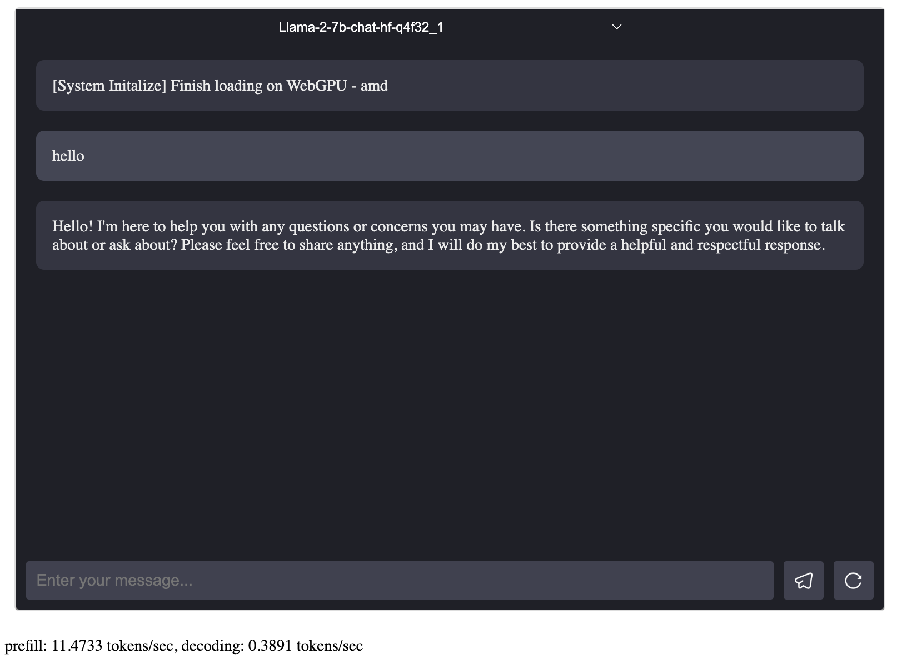

# SimpleChat

This is a simple chat app based on WebLLM. To try it out, you can do the following steps
under this folder. Demo: [https://playground.cascade.chat](https://playground.cascade.chat)



## Run in local

```bash
npm install
npm start
npm run build
```

## Run in container

```bash
docker build -t simple-chat .
docker run -p 8080:80 simple-chat
```

## Deployment

```bash
npm run deploy
```